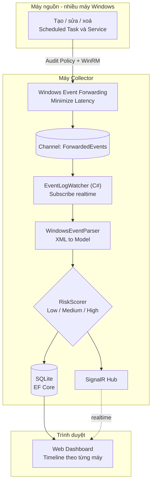

# TaskServiceMonitor

Ứng dụng giám sát tập trung hành vi Scheduled Task và Windows Service qua Windows
Event Log. Dự án thực tập tại Galaxy Innovation Hub (HDBank), mentor thuộc team
Network Security. Đọc file này trước khi thực hiện bất kỳ thay đổi nào.

## Kiến trúc tổng thể



## Trạng thái hiện tại

Đã hoàn thành tuần 1 (kiến thức nền + thực hành xác nhận Event ID).

Tuần 2 — **bước 1 và 2 của roadmap đã xong**:

- Bước 1: `EventWatcherService` subscribe realtime nhiều channel, ghi XML thô ra
  `samples/`. Đã thu **17 mẫu thật**, phủ 8/10 Event ID (thiếu 7034, 7036).
- Bước 2: `WindowsEventParser` chuyển XML → `WindowsMonitorEvent`, có nhánh
  riêng cho 8 Event ID đã có mẫu + nhánh dự phòng cho ID chưa có mẫu.
  Có **24 unit test** chạy trên mẫu XML thật: `dotnet test` — 24/24 pass.

- Bước 3: lưu PostgreSQL qua EF Core + API query lại. Đã verify với DB thật:
  61 event lưu thành công, chạy lại lần hai **không nhân đôi** (unique index
  `IX_Events_Dedup` chặn), `Data` là `jsonb` query được bằng `->>`,
  `dotnet test` 30/30 pass.

- Bước 4: SignalR (`Realtime/MonitorHub.cs`, `Realtime/EventNotifier.cs`) +
  dashboard HTML/JS thuần ở `wwwroot/`. Đã verify: `/` trả `index.html`,
  `/monitorHub/negotiate` trả `connectionId`, `signalr.min.js` phục vụ cục bộ.
- Bước 5: `Monitoring/RiskScorer.cs` + cột `RiskLevel`. Đã verify: backfill
  `--rescore` cập nhật đúng **12 dòng → Medium** (toàn bộ event 4702),
  `?risk=Medium` trả đúng 12 dòng, `dotnet test` **51/51 pass**.

**Toàn bộ roadmap 5 bước đã xong.** Việc còn lại là triển khai WEF nhiều máy
(xem mục cuối file).

## Bước 6 — Quản lý Task/Service bằng WinAPI (theo yêu cầu mới của mentor)

App không chỉ *xem* log nữa mà **tự thao tác** được Task/Service, thao tác đó sinh
ra log thật, rồi chính app bắt lại và hiện lên dashboard. Vòng khép kín.

| Tầng | Cách gọi Windows |
|---|---|
| Service | **P/Invoke `advapi32.dll`** — `OpenSCManager`, `EnumServicesStatusEx`, `QueryServiceConfig`, `CreateService`, `DeleteService`, `ChangeServiceConfig`, `ControlService`. Đúng bộ hàm `services.msc` dùng |
| Scheduled Task | **COM `Schedule.Service`** (late binding, không cần TLB). Windows không expose Task Scheduler qua DLL phẳng |

- `Management/Native/AdvApi32.cs` — chỉ khai báo P/Invoke, không logic. Handle bọc
  `SafeHandle` để không rò khi có exception.
- `Management/ServiceManager.cs`, `Management/TaskManager.cs` — lớp bọc an toàn.
- **`Management/SafeNameGuard.cs` — rào an toàn, đọc kỹ trước khi sửa.** Web UI này
  chạy quyền Administrator (bắt buộc để đọc channel `Security`). Không có rào thì một
  cú bấm nhầm trên trình duyệt xoá mất service hệ thống. Quy tắc: **đọc mọi thứ, ghi
  chỉ trên tên bắt đầu bằng tiền tố** `Management:WritablePrefix` (mặc định
  `WinSentinel`) và phải nằm ở thư mục gốc. Chặn ở **tầng server**, không phải chỉ ẩn
  nút. Có 21 unit test riêng cho lớp này.
- `TaskManager.Create` dựng **đúng XML schema mà `WindowsEventParser` đã biết đọc** —
  XML ghi ra chính là XML đọc lại được từ event 4698.
- Thao tác quản lý **không cần nối gì thêm** để lên dashboard: chúng sinh event
  Windows thật, `EventWatcherService` đang lắng nghe sẵn sẽ bắt được.

### Thao tác nào sinh ra Event ID nào

Bảng này là thước đo độ phủ — app theo dõi 10 ID, tự sinh được 8:

| Event ID | Thao tác trong app |
|---|---|
| 4698 Task created | Tạo task (tên chưa tồn tại) |
| 4699 Task deleted | Xoá task |
| 4700 Task enabled | Nút "Bật" |
| 4701 Task disabled | Nút "Tắt" |
| 4702 Task updated | Ghi đè task đã có (nút "Sửa lệnh") |
| 4697 + 7045 Service installed | Tạo service (một thao tác sinh **hai** event, hai channel khác nhau) |
| 7040 Start type changed | Nút đổi start type |
| 7036 / 7034 | **Không tự sinh được** — máy dev không phát 7036, còn 7034 là service crash, không ép ra được một cách sạch sẽ |

`RegisterTask` dùng cờ `TASK_CREATE_OR_UPDATE`: cùng một endpoint `POST /api/tasks`,
tên chưa có thì sinh 4698, tên đã có thì sinh 4702. Không cần endpoint riêng.

### Feed event ngay trong tab quản lý

`app.js` phát event qua `window.eventBus`, `manage.js` đăng ký nhận. Nhờ vậy tab
Tasks/Services có bảng "event vừa sinh ra" của riêng nó — thao tác xong thấy log ngay,
không phải chuyển sang tab Dashboard. Cùng một luồng SignalR, không mở thêm kết nối.

### Bẫy: SignalR và Minimal API dùng HAI bộ serializer tách biệt

`ConfigureHttpJsonOptions` **chỉ** áp cho Minimal API. SignalR có
`JsonHubProtocolOptions.PayloadSerializerOptions` riêng, đăng ký qua
`AddSignalR().AddJsonProtocol(...)`. Đăng ký thiếu một bên thì enum hiện **số** lúc
realtime rồi thành **chữ** sau khi F5 (đã dính lỗi này một lần).

## Bước 7 — Resume sau restart bằng EventRecordID cursor (theo gợi ý mentor)

Lấp gap đã tự ghi trước đó ("chưa lưu bookmark, restart bỏ lỡ event lúc app
down"). Mentor gợi ý cần lấy được **Log ID** (tức `EventRecordID` — số thứ tự
DUY NHẤT của từng bản ghi trong một channel, khác hẳn Event ID như 4698/7045
vốn chỉ là "loại" sự kiện) để trích xuất log tin cậy bằng WinAPI.

- **Không dùng class `EventBookmark`**: cần `BinaryFormatter` để
  serialize/khôi phục, mà .NET 8 đã gỡ bỏ `BinaryFormatter` theo mặc định.
- **Giải pháp**: `RecordId` vốn đã được `WindowsEventParser` đọc và lưu DB từ
  trước (dùng làm khoá `IX_Events_Dedup`) — tận dụng chính nó làm "con trỏ".
  `EventWatcherService` đọc `MAX(RecordId)` theo **Channel** (không theo
  Hostname — RecordId là số thứ tự của channel trên máy chạy app, không thuộc
  về từng máy nguồn, quan trọng khi dùng `ForwardedEvents` sau này) lúc khởi
  động, nhúng vào XPath filter qua `MonitoredEventIds.BuildXPathFilter(channel,
  afterRecordId)` → `*[System[(...) and (EventRecordID>N)]]`. Có cursor thì
  bật `ReadExistingEvents = true` để đọc bù đúng phần lỡ mất, không phải toàn
  bộ lịch sử.
- Có xử lý trường hợp channel bị `wevtutil cl` (clear) trong lúc app tắt: so
  cursor đã lưu với `EventLogSession.GetLogInformation(...)` của channel, nếu
  record mới nhất hiện có nhỏ hơn cursor cũ (dấu hiệu số thứ tự bị đánh lại từ
  đầu) thì bỏ cursor, subscribe lại từ đầu thay vì lọc mất toàn bộ event mới.
- Test mới `MonitoredEventIdsTests.cs` (3 test cho `BuildXPathFilter`),
  `dotnet test` **80/80 pass**. Phần đọc DB/WinAPI thật (`ResolveCursor`,
  `LoadLastKnownRecordIdsAsync`) verify bằng tay: tạo event, tắt app, sinh
  thêm event trong lúc tắt, bật lại — số event mới khôi phục đúng bằng số đã
  sinh lúc app down, không nhân đôi (`IX_Events_Dedup` vẫn chặn).

## Bước 8 — Description / Level / Task Category, Saved Events, khung chi tiết

Mục tiêu: 4 panel log hoạt động như Event Viewer thật. **Đọc
[docs/wef-mapping.md](docs/wef-mapping.md)** — tài liệu đối chiếu dự án với 2 tài
liệu WEF/WES của Microsoft, kèm phần giải thích "vì sao channel X chưa có data".

- **Description KHÔNG nằm trong XML.** Nó là kết quả render message DLL của
  provider (`EvtFormatMessage` → `EventRecord.FormatDescription()`), chỉ lấy được
  khi còn giữ `EventRecord` **sống**. Trước bước 8 cả hai đường đọc log đều gọi
  `record.ToXml()` rồi vứt record ngay → mất vĩnh viễn. Nay dồn vào
  `Monitoring/EventRecordDescriber.cs`, nối qua overload
  `WindowsEventParser.Parse(rawXml, record)` — **một chỗ duy nhất**, không thể có
  nhánh nào quên gọi.
- **NGOẠI LỆ CÓ CHỦ ĐÍCH của quy ước "không làm việc nặng trong
  `EventRecordWritten`"**: `FormatDescription()` được gọi ngay trong callback đồng
  bộ đó. Không có lựa chọn khác (record bị dispose trước khi `EventPersistenceService`
  chạy), và watcher chỉ nhận 15 Event ID lưu lượng thấp. Lý do đã ghi ngay tại chỗ
  gọi — **đừng "sửa lại cho đúng quy ước"** mà không đọc.
- **`<RenderingInfo>` chỉ tồn tại ở event chuyển tiếp qua WEF chế độ "Rendered
  Text"** (mặc định). Khối này mang sẵn Description + tên Level/Task/Opcode đã
  dịch, nên collector đọc được mà không cần message DLL của máy nguồn. Đổi
  subscription sang `wecutil ss <sub> /cf:Events` sẽ **cắt mất khối này** → mất
  Description toàn bộ event forwarded. Parser ưu tiên `<RenderingInfo>`, không có
  mới hỏi record sống.
  - ⚠️ Nhánh này **chưa verify bằng mẫu thật** (máy dev chưa bật WEF). Fixture
    `renderinginfo_synthetic.xml` là file **tự soạn** — xem ghi chú trong chính file.
- `Level`/`TaskCategoryId`/`Keywords` thì **có** trong `<System>` của XML → parser
  đọc thẳng, test được bằng fixture thật, và `--backfill` dựng lại được cho dòng cũ.
  Riêng `Description` **không backfill được** (dòng cũ mãi null).
- **Saved Events**: `Monitoring/SavedLogStore.cs` dùng `ExportLogAndMessages` chứ
  không phải `ExportLog` — bản `AndMessages` nhúng luôn chuỗi đã render nên mở file
  trên máy khác vẫn còn Description. Đọc lại qua `PathType.FilePath` bằng chính
  `AdHocLogReader`. **Rào chống path traversal ở tầng server** (`Resolve()`), cùng
  triết lý `SafeNameGuard` — tên file đến thẳng từ URL mà app chạy Administrator.
- **Khung chi tiết dọc dưới bảng** (`wwwroot/detailpane.js`) cho 4 panel log.
  Dashboard/Tasks/Services **giữ nguyên modal** — cố ý, không đổi cái đang chạy tốt.
  `detailpane.js` phải load **trước** `app.js`.
- `--rescore` đổi thành `--backfill` (giữ alias cũ), nay tính lại cả nhóm field mới.

## Bước 10 — Whitelist đầu vào, Create Task đầy đủ, Dashboard trực quan

- **LỖ HỔNG đã vá**: `SafeNameGuard` chỉ kiểm tra **tên**, nên `BinaryPath` của service
  đi thẳng vào `CreateServiceW` với account `null` → service chạy **LocalSystem**,
  start được ngay qua API. `Command`/`Arguments` của task cũng không kiểm tra gì.
  Nay có `Management/InputPolicy.cs`.
- **`InputPolicy` và `SafeNameGuard` KHÔNG thay thế nhau**: guard trả lời "được phép ghi
  lên tên này không", policy trả lời "giá trị nhập vào có hợp lệ không". Cả hai đều
  phải gọi.
- Thứ tự 7 bước của `EnsureAllowedExecutable` là **load-bearing**: bóc exe khỏi tham số
  → giãn `%VAR%` → `Path.GetFullPath` → chặn UNC → bắt file tồn tại → thư mục cho phép
  → tên exe cho phép. Bỏ bước `GetFullPath` thì
  `C:\Windows\System32\..\..\Users\x\evil.exe` lọt vì vẫn khớp tiền tố chuỗi.
- ⚠️ **Whitelist chặn ĐƯỜNG DẪN, không chặn HÀNH VI**: `cmd.exe /c <bất cứ gì>` vẫn
  chạy. Nó thu hẹp bề mặt tấn công, **không phải sandbox** — đừng mô tả quá lên.
  Cố ý không có `powershell.exe` trong danh sách mặc định (nó nhận `-EncodedCommand`).
- `Management` section trong `appsettings.json` trước đây **không tồn tại**, chỉ có
  default `"WinSentinel"` trong code. Nay khai đầy đủ.
- **Lỗi mất dữ liệu đã sửa**: `POST /api/tasks` là ghi đè toàn bộ, mà form sửa để
  trắng `arguments`/`startBoundary` → bấm "Cập nhật" là mất arguments và dời trigger.
  Hộp thoại mới **nạp lại định nghĩa** từ `/api/tasks/detail` trước khi sửa.
- `BuildTaskXml` nay nhận `TaskDefinitionRequest` (một model) thay vì 3 tham số rời —
  vẫn là **hàm thuần**, test được không cần Windows. Đó là lý do giữ đường XML làm
  mặc định thay vì object model COM.
- `CreateViaObjectModel` là đường tương đương dùng `TaskService.NewTask()` +
  `RegisterTaskDefinition` (theo tài liệu TaskService), bật bằng `?api=objectmodel`.
  **Cả hai đường đi qua cùng `Validate()`** — không đường nào lách được whitelist.
- **Hộp thoại Create Task là MODELESS** (`.dialog`, không có lớp phủ) — mở ra vẫn thao
  tác được bảng phía sau, kéo di chuyển được. Cố ý KHÔNG dùng lại `#modal` vì cái đó
  `position:fixed; inset:0` chặn toàn trang.
- **Màu biểu đồ dùng `--chart-*`, KHÔNG dùng `--risk-*-bg`**: mấy biến risk là nền
  badge nhạt (`#eaeef2`, `#fff8c5`), vẽ cột chồng lên nhau gần như vô hình.
- Channel "**TẮT**" trong dropdown = Windows tắt channel đó (`enabled: false`), không
  ghi event nào. Bật: `wevtutil sl "<tên>" /e:true` (Administrator).

## Bước 9 — Chi tiết Task/Service, Save Selected Events, Dashboard phân tích

- **LỖI ĐUA đã sửa** (`ChannelStatusRegistry`): `TrySubscribe` trước đây bật watcher
  rồi mới gọi `MarkSubscribed`, mà hàm đó **ghi đè** với `EventsReceived: 0`. Có
  cursor thì `readExistingEvents = true` nên Windows bắn event đọc bù ngay tại
  `Enabled = true` (thread khác) → số đếm bị xoá sạch, Log Summary báo "đã subscribe
  nhưng chưa có event" dù event đã vào DB. Sửa hai lớp: gọi `MarkSubscribed` **trước**
  khi bật watcher, và đổi hàm đó sang `AddOrUpdate` giữ nguyên số đếm. Có test riêng
  (`ChannelStatusRegistryTests`). **Đừng đảo lại thứ tự hai dòng đó.**
- Cột "RecordId cuối" cũ hiển thị *cursor* (đóng băng lúc khởi động) chứ không phải
  RecordId mới nhất → tách thành **hai cột** + thêm `ChannelStatus.LastRecordId`.
- **Endpoint chi tiết riêng** `GET /api/tasks/detail?path=` và `GET /api/services/{name}`:
  đọc `Definition.Triggers/.Principal/.RegistrationInfo` (COM) và `QueryServiceConfig2`
  (3 lời gọi/service) là **quá đắt để nhét vào danh sách** vài trăm dòng. Danh sách
  giữ nguyên `TaskInfo`/`ServiceInfo` gọn.
- `TaskManager.Describe` trước chỉ đọc **action đầu tiên** (`break`) và gán nhầm mọi
  action ≠ Exec thành "ComHandler" — `DescribeActionType` nay map đủ 0/5/6/7.
- **`lpDependencies` là MULTI_SZ** (nhiều chuỗi, kết thúc bằng hai null).
  `Marshal.PtrToStringUni` chỉ trả chuỗi ĐẦU TIÊN → phải dùng
  `ServiceManager.ReadMultiSz`. Verify thật: `Spooler` trả `RPCSS, http`.
- `QUERY_SERVICE_CONFIG` và `ENUM_SERVICE_STATUS_PROCESS` **vốn đã marshal đầy đủ rồi
  bị vứt** — Dependencies/ErrorControl/LoadOrderGroup/ProcessId/ControlsAccepted lấy
  được mà không tốn thêm syscall nào.
- **Bộ lọc theo cột giờ dùng chung** cho cả 4 panel log: `leaf` phải có `rows()` và
  `onApply()` thay vì hardcode `events.filter(channel)`. `logsbrowse.js` đăng ký leaf
  riêng qua `window.initColumnFilters`.
- 3 panel curated có **2 chế độ nguồn**: "App đã bắt" (mảng `events`) và "Toàn bộ
  channel" (`/api/logs/browse`). Cùng một bộ cột — vì vậy `LogBrowseEventDto` phải
  mang thêm nhóm enrichment (`ImagePath`, `StartType`, `TaskCommand`…), thiếu là cột
  trống khi đổi chế độ.
- `InternalsVisibleTo` cho project test — các helper thuần hàm để `internal`, không
  nới thành `public` chỉ để test.
- **Xem [docs/log-id-demo.md](docs/log-id-demo.md)** cho kịch bản demo Log ID/Log Summary.

## Bước 11 — Phân rã hành vi → Event ID và tầng Cảnh báo

Mentor giao hai việc: (1) liệt kê các hành vi cần phân tích và phân rã ra Event ID
nào, (2) gom log đó lại và **alert lên webapp**. **Đọc
[docs/hanh-vi-mapping.md](docs/hanh-vi-mapping.md)** — đó là câu trả lời cho ý (1)
và là bảng đối chiếu chuẩn cho toàn bộ danh mục rule.

### Ba hành vi mentor nêu mà Windows KHÔNG phát event nào

Phát hiện quan trọng nhất của bước này, **đừng đi tìm lại Event ID cho chúng**:

- **Đổi `binPath` / đổi tài khoản chạy service**: SCM không ghi event. `7040` **chỉ**
  báo đổi start type (4 field `param1..param4`, không có đường dẫn lẫn tài khoản).
  Lấp bằng **hai đường độc lập**: `4657` (audit registry, cần SACL trên
  `HKLM\SYSTEM\CurrentControlSet\Services`) và `ServiceConfigWatcher` (poll +
  diff snapshot bằng `QueryServiceConfig`).
- **Service crash**: `7034` **chưa từng phát** trên máy dev, `7036` cũng vậy. Đã thêm
  `7031` (máy dev CÓ phát), `7024`, `7000`, `7009`.

### Kiến trúc

- `Detection/SuspiciousIndicators.cs` — **nguồn sự thật DUY NHẤT** về thư mục ghi
  được / LOLBin / cờ PowerShell / principal quyền cao. Trước đây kiến thức này nằm
  trong hai mảng private của `RiskScorer`.
- `Detection/RuleCatalog.cs` — 15 rule thuần hàm trên MỘT event. Đối chiếu 1-1 với
  bảng ở `docs/hanh-vi-mapping.md` mục 4.2 — **sửa ở đây thì sửa cả tài liệu đó**.
- `Detection/CorrelationRules.cs` — rule cần tra DB nhiều event
  (`TASK_COMMAND_CHANGED`, `TASK_CREATE_THEN_DELETE`). Đây chính là phần "phân tích
  tương quan hành vi" mentor nêu, trước đây ghi là hoãn.
- **`RiskScorer` nay CHỈ là lớp mỏng uỷ quyền** cho `RuleCatalog.HighestSeverity`.
  Không còn giữ rule riêng. Lý do: để hai bộ rule song song thì sớm muộn dashboard
  tô màu một đằng, tab Cảnh báo nói một nẻo.
- `Severity` của `Alert` **dùng lại `RiskLevel`**, không tạo enum thứ hai — CSS
  (`.risk--High/Medium/Low`), bộ lọc, biểu đồ đã bám theo nó rồi.
- Một event có thể sinh **nhiều** cảnh báo → bảng `Alerts` riêng, không phải thêm cột.

### Những chỗ dễ làm sai

- **`Severity` lưu thành CHUỖI** (`HasConversion<string>`), nên **không được viết
  `a.Severity >= minimum`** trong truy vấn EF: nó dịch thành so chuỗi theo bảng chữ
  cái, mà `'High' >= 'Medium'` là FALSE → lọc "Medium trở lên" âm thầm nuốt mất đúng
  nhóm High. Dùng `AlertEndpoints.SeverityAtLeast()` → `IN ('Medium','High')`.
- **`ExecutablePathParser` CỐ Ý không gọi `Path.GetFullPath`**, khác hẳn
  `InputPolicy`: đường dẫn ở đây đến từ event log của **máy khác**, file có thể không
  tồn tại trên máy chạy app, và `GetFullPath` sẽ ghép đường dẫn tương đối với thư mục
  làm việc hiện tại. `InputPolicy` thì ngược lại — nó xét đường dẫn **sắp chạy trên
  chính máy này** nên bắt buộc phải chuẩn hoá tuyệt đối. Hai lớp dùng chung phần
  **bóc** exe (`ExtractExecutable`), không dùng chung phần chuẩn hoá.
- `ImagePath` có 3 dạng thật phải xử lý: có nháy + tham số, tiền tố `\??\`, và
  `\SystemRoot\`. So chuỗi thô là vừa sót vừa báo nhầm.
- **`ServiceConfigWatcher` lần chạy đầu CHỈ lập baseline**, không sinh cảnh báo — bỏ
  bước này là ~200 cảnh báo giả ngay lần bật đầu tiên. Snapshot lưu DB để restart
  không mất mốc (cùng tinh thần cursor `RecordId` ở bước 7).
- `AlertEvaluator` gọi **bên trong nhánh `if (await storage.SaveAsync(evt))`** của
  `EventPersistenceService` — chỗ duy nhất biết chắc event là MỚI (đã qua dedupe),
  nên có ngữ nghĩa exactly-once miễn phí.
- Rule mức **Low = "ghi nhận hành vi"** (tạo task, cài service). Mentor CÓ liệt kê
  chúng nên phải sinh cảnh báo, nhưng không đẩy `RiskLevel` của event lên và tab Cảnh
  báo mặc định lọc từ Medium — nếu không dashboard ngập màu.
- **Banner cảnh báo KHÔNG dùng lại `showToast` của `manage.js`**: chỗ đó chỉ có một
  thẻ `#toast`, gọi cái thứ hai là đè cái thứ nhất và timer 6 giây của lần trước vẫn
  tắt nhầm cái mới. Một event sinh nhiều cảnh báo cùng lúc nên phải xếp chồng được →
  `#alert-stack` riêng trong `alerts.js`.
- `window.alertBus` tách hẳn khỏi `window.eventBus` — kết nối SignalR nằm trong
  `connectRealtime()` của `app.js` nên `alerts.js` không với tới được.

### Tinh chỉnh dựa trên dữ liệu thật (không chốt bằng cảm tính)

- **`SERVICE_STARTTYPE_CHANGED` giữ Medium kể cả khi đổi sang auto start.** Thiết kế
  ban đầu định nâng High, nhưng mẫu `7040` thật duy nhất trên máy dev là **BITS đi
  `demand start` → `auto start`** — hành vi bình thường và lặp rất thường xuyên.
  Chấm High là tự làm ngập tab Cảnh báo.
- `rundll32.exe` / `msiexec.exe` trong danh sách LOLBin là **nguồn dương tính giả
  điển hình**. Phải chạy `--rebuild-alerts` trên dữ liệu thật, đếm theo từng rule rồi
  mới chốt danh sách.
- Test `RuleCatalogTests.MauThat_KhongSinhCanhBaoHigh` chạy trên **cả 14 fixture
  thật** — nới rule đến mức gây dương tính giả thì test đổ. Đây là test quan trọng
  nhất của tầng phát hiện.

### Lệnh CLI mới

`dotnet run --project TaskServiceMonitor -- --rebuild-alerts` — chấm lại toàn bộ rule
trên event đã lưu, in số cảnh báo **theo từng rule** (đó là cách đo dương tính giả).
Chạy lại bao nhiêu lần cũng không nhân đôi nhờ unique index `IX_Alerts_Dedup` trên
`(SourceEventId, RuleId)`.

## Bước 12 — Chuông thông báo, trang Khôi phục, lọc khoảng thời gian

### ⚠️ QUY ƯỚC MỚI, ÁP CHO MỌI FILE JS: bọc IIFE, xuất tường minh qua `window.`

`wwwroot/*.js` là `<script>` **thường**, không phải module — mọi khai báo top-level
rơi vào **chung một global scope**. File nạp sau **ghi đè lặng lẽ** lên hàm cùng tên
của file nạp trước: không lỗi, không cảnh báo, chỉ là chạy nhầm hàm.

Đã trả giá một lần: `alerts.js` khai báo `render`/`buildRow`/`cell` ở top-level, nạp
sau `app.js` nên `loadInitial()` của app.js gọi phải `render()` của bảng Cảnh báo →
**bảng Dashboard trống trơn, card "Máy đang gửi event" đứng ở 0, mảng `events` vẫn có
đủ 200 phần tử và console KHÔNG hề có lỗi nào**. Phải render trang bằng trình duyệt
thật rồi đo từng bước bên trong `loadInitial` mới lộ ra.

Nay `alerts.js`, `manage.js`, `logsbrowse.js`, `timerange.js`, `notifications.js`,
`recovery.js` đều đóng kín. Thứ cần chia sẻ gán tường minh:
`window.showToast` (manage.js), `window.refreshSavedLogs` (logsbrowse.js),
`window.createTimeRange`, `window.pushNotification`, `window.showRecovery`.

Va chạm còn sót lại lúc rà: `textCell` khai báo ở **cả** `manage.js` lẫn
`logsbrowse.js` — hai bản cài đặt tình cờ giống hệt nhau nên chưa gây hại, nhưng sửa
một bên là bên kia âm thầm đổi theo. Đã bọc IIFE cả hai, `window.textCell` nay
**không tồn tại** (kiểm tra bằng cách này khi nghi ngờ).

Cách rà: liệt kê khai báo ở **depth 0** của từng file rồi tìm tên trùng. Đếm theo
dòng đơn thuần sẽ **báo nhầm** vì không phân biệt được khai báo bên trong IIFE.

### Ba tầng "có gì mới" — ĐỪNG gộp lại

| | Đếm cái gì | Lưu ở đâu | Ai đọc |
|---|---|---|---|
| Badge tab **Cảnh báo** | chưa **XỬ LÝ** | cột `Alerts.Acknowledged` trong DB | mọi máy, mọi phiên |
| Badge chuông / tab **Thông báo** | chưa **ĐỌC** | một mốc thời gian trong `localStorage` | riêng trình duyệt này |
| Banner `#alert-stack` | vừa nổ ra | không lưu, 10 giây tự tắt | phiên hiện tại |

Một cảnh báo đã đọc vẫn đang chờ xử lý — hai trạng thái không thay thế nhau, hai con
số **nên** lệch nhau.

- **"Đã đọc" lưu bằng MỘT mốc thời gian, không phải danh sách id**: danh sách id phình
  vô hạn theo số cảnh báo (DB đang có hàng chục nghìn sau `--rebuild-alerts`), còn một
  mốc đủ trả lời đúng câu hỏi "cái này có mới hơn lần cuối tôi xem không".
- **Lần đầu vào app, mốc đặt là "bây giờ"**, không phải 0 — nếu không thì toàn bộ lịch
  sử cảnh báo hiện là chưa đọc ngay lần mở đầu tiên, chuông báo 99+ mà chẳng có gì thật
  sự mới.
- `markAllRead` lấy mốc từ **thông báo mới nhất** nếu nó ở tương lai, không phải
  `Date.now()`: đồng hồ máy nguồn chạy nhanh hơn thì bấm xong badge không về 0, trông
  như nút hỏng.
- Chuông **chỉ nhận Medium trở lên**, cùng ngưỡng với tab Cảnh báo. Rule mức Low là
  "ghi nhận hành vi" (tạo task, cài service) — đẩy hết lên chuông thì chuông kêu suốt.
- Thông báo **không chỉ có cảnh báo**: việc app đọc bù event sau restart cũng vào đây,
  mà nó chẳng phải hành vi đáng ngờ nào cả.

### Trang Khôi phục — `GET /api/system/recovered`

Bước 7 mới chỉ hiện badge "↺ khôi phục N" ở Log Summary: biết là **có** đọc bù nhưng
không biết đọc bù được **những gì**. Nay badge đó là `<button>`, bấm vào mở tab Khôi
phục và lọc sẵn đúng channel.

- **KHÔNG thêm cột `IsRecovered` vào bảng `Events`** (không phải làm migration). Mỗi
  channel đã có sẵn hai mốc đủ để suy ra: `ResumeFromRecordId` (cursor = `MAX(RecordId)`
  đã lưu lúc khởi động) và `CatchUpTargetRecordId` (RecordId mới nhất đang có trong log
  tại đúng thời điểm đó). Mọi event trong khoảng nửa mở **`(cursor, target]`** chính là
  phần sinh ra lúc app tắt — không thể lẫn với dữ liệu cũ, vì **theo định nghĩa** cursor
  là số lớn nhất đã có trong DB.
- Hệ quả phải nói rõ trên UI: hai mốc tính lại **mỗi lần khởi động**, nên trang này nói
  về **phiên chạy hiện tại**, không phải lịch sử mọi lần khôi phục.
- Trang còn hiện **cửa sổ "app không nhìn thấy gì"**: từ event cuối cùng trước khi mất
  kết nối (`MAX(TimeCreated)` với `RecordId <= cursor`) đến event khôi phục đầu tiên.
  Đó mới là thứ cần đối chiếu khi mất mạng.
- 🪤 **Lỗi đã dính khi viết**: ban đầu lấy `rows.Count` làm số tổng, mà `rows` đã bị
  `take` cắt → `take=5` báo "recovered: 5" trong khi thực tế là **5.115**. Phải
  `CountAsync` **riêng**, và trả thêm `shown` để trang tự biết mình đang hiện thiếu.
  Cùng lý do, `downtimeToUtc` phải `MinAsync` trên **toàn khoảng**, không lấy từ trang
  đang trả về (trang đó là phần **mới nhất**).
- `caughtUpCount` (watcher đếm được trong phiên) và `recovered` (số đã kịp ghi xuống DB)
  **chênh nhau là bình thường** khi đang đọc bù dở — trang hiện cả hai thay vì giấu một.
- `ChannelStatusRegistry.SessionStartedUtc` dùng thay `Process.StartTime` (giờ local, và
  lệch khi chạy qua `dotnet run`).

### Badge "↺ đọc bù" trên từng dòng — `wwwroot/recoverymark.js`

Trang Khôi phục trả lời "app đã đọc bù được những gì" khi bạn **chủ động** vào xem.
Badge này trả lời câu ngược lại ngay tại chỗ đang đọc: "dòng tôi đang nhìn có phải thứ
vừa được vá lại không?" — cần thiết vì event đọc bù nằm **lẫn** giữa event realtime
theo đúng thứ tự thời gian, nhìn bảng không tài nào phân biệt được.

- Vẫn **không thêm cột nào vào DB**: chỉ cần `channel` + `recordId` của dòng (đã có sẵn
  trong mọi payload) đem so với khoảng `(cursor, target]` của channel đó.
- Badge gắn vào **ô "Thời gian"**, KHÔNG thêm cột mới: thêm cột sẽ làm lệch bề rộng đã
  lưu ở localStorage của `colresize.js` **và** lệch chỉ số cột của bộ lọc theo header
  (`leaf.columns[colIndex]`) ở cả 4 bảng log.
- `recoverymark.js` là **chỗ DUY NHẤT** gọi `/api/system/recovered` cho phần tóm tắt;
  `notifications.js` dùng lại qua `whenReady()` + `summary()`. Ba chỗ cùng hỏi một câu
  mà mỗi chỗ tự fetch thì có ngày ba chỗ nói ba con số khác nhau lúc đang đọc bù dở.
- Phải gọi lại `render()` trong `whenReady()`: bảng vẽ xong **trước** khi fetch này về,
  không vẽ lại thì mở trang lên không thấy badge nào cho tới khi tình cờ có event mới.
- Áp cho cả `logsbrowse.js` qua `window.timeCell(evt, text)` — tham số `text` để nơi đó
  giữ định dạng ngày giờ đầy đủ của riêng nó; badge dùng chung, định dạng thì không.
- Đã kiểm biên: `recordId == cursor` → **không** badge, `== target` → **có** badge
  (khoảng nửa mở), `recordId` null hoặc khác channel → không badge.

### Lọc thời gian ở 4 panel log — phải chạy Ở SERVER, nhúng vào XPath

`AdHocLogReader` đọc `count` event **mới nhất** rồi dừng. Lọc thời gian phía client vì
vậy chỉ là "trong 50 dòng mới nhất, dòng nào thuộc 24 giờ qua" — với channel bận thì 50
dòng đó có khi chỉ trải trong vài phút, và thứ cần tìm (ví dụ event sinh ra lúc app
đang tắt) **không cách nào chạm tới**. Nên `AdHocLogReader.BuildBrowseXPath` nhúng mốc
thời gian thẳng vào XPath: `*[System[(EventID=X) and TimeCreated[@SystemTime>='…']]]`.

- Mốc BẮT BUỘC là ISO-8601 UTC có hậu tố `Z`. Truyền giờ local vào là lệch âm thầm —
  Windows **không báo lỗi**, chỉ trả về ít hơn. Có 6 test riêng
  (`AdHocLogXPathTests`) vì đây là loại sai không thể phát hiện bằng mắt.
- 3 panel curated có hai chế độ: "App đã bắt" lọc trên mảng `events` (không có request
  nào để gửi `from`/`to`), "Toàn bộ channel" gửi lên server. `renderLogLeaves` áp bộ lọc
  cho **cả hai** — thừa ở chế độ channel nhưng vô hại, và tránh một nhánh if dễ quên.
- Đổi khoảng thời gian **gọi lại API ngay**, không đợi bấm "Tải lại" (khác ô Event ID):
  nó quyết định đọc **vùng nào** của log, chứ không phải lọc lại vùng đã đọc.

### Trang Khôi phục: xem cả channel app KHÔNG theo dõi

Chỉ channel trong `EventLog:Channels` mới có cursor để đọc bù — thêm channel cho app
*theo dõi* là sửa `appsettings.json` + khởi động lại. Nhưng để *xem* channel khác trong
đúng khoảng mất kết nối thì không cần: ô "Log Name" có **hai optgroup**,
`recovered:<channel>` lọc trên danh sách đã đọc bù, `live:<channel>` đọc thẳng qua
`/api/logs/browse` với `from`/`to`. Banner vàng nói rõ dữ liệu đó **không** nằm trong
CSDL và **không** được chấm cảnh báo — nếu không người xem sẽ tưởng app đang giám sát
cả channel đó.

- 🪤 **Field là `isEnabled`, KHÔNG phải `enabled`** (`LogChannelInfo`). Viết nhầm một
  lần: `!undefined` là true nên **cả 1.321 channel** bị đánh dấu "TẮT" và disabled,
  danh sách trống rỗng mà không có lỗi nào. Đối chiếu `logsbrowse.js` nếu còn nghi ngờ.
- 🪤 **Cận trên của "khoảng mất kết nối" là event đọc bù MỚI NHẤT**, không phải cột
  `downtimeToUtc` của bảng channel — cột đó là event đọc bù **đầu tiên** (mốc mở đầu
  khoảng mù). Lấy nhầm thì cửa sổ co lại còn một khoảnh khắc và bấm nút xong danh sách
  khôi phục về **0 dòng**. Cộng thêm 1 giây vì ô `datetime-local` chỉ nhận tới giây.
- `timeRange.set()` phải tự ghép chuỗi giờ **máy**, không dùng `toISOString().slice()`
  — hàm đó trả giờ UTC, đổ vào ô nhập là hiện lệch đúng 7 tiếng.

### Kéo-resize cột: chỉ gọi được khi panel ĐÃ hiện

`makeColumnsResizable` đọc `getBoundingClientRect().width`, mà phần tử đang `hidden` trả
về **0**. Nên phải gọi trong `onTabShown`, không gọi lúc nạp file. Nay đã có cho
Thông báo, Khôi phục (2 bảng) và Cảnh báo (2 bảng); hàm tự chống gọi lặp bằng
`dataset.resizableInit`.

### 🪤 Bẫy flexbox ở header: NHIỀU item cùng `margin-left: auto`

Đặt `margin-left: auto` cho **cả** `.bell-wrap` lẫn `.theme-toggle` → khoảng trống bị
**chia đều** cho chúng chứ không phải item đầu tiên ăn hết, kết quả là chuông rơi ra
**giữa header**. Chỉ một mình `.bell-wrap` giữ margin auto, `.bell-wrap + .theme-toggle`
phải trả về 0.

### Lọc khoảng thời gian — `wwwroot/timerange.js` + `from`/`to` ở API

Một bộ điều khiển dùng chung cho 4 panel (Dashboard, Cảnh báo, Thông báo, Khôi phục),
quy ước id: `#<prefix>-preset`, `#<prefix>-custom`, `#<prefix>-from`, `#<prefix>-to`.

- **Lọc ở SERVER, không lọc mảng đã tải** với Dashboard và Cảnh báo: client chỉ giữ 200
  event / 300 cảnh báo mới nhất, nên lọc client cho khung "7 ngày" thực chất chỉ lọc
  trong đúng chỗ đó — càng xa hiện tại càng sai. Đổi khoảng thời gian là **đổi câu hỏi**,
  phải hỏi lại server.
- **Vẫn phải lọc lại ở client** cho đường realtime: event/cảnh báo tới qua SignalR
  **không đi qua** `/api/events` hay `/api/alerts`, nên đang xem cửa sổ quá khứ mà chèn
  thẳng vào là sai hẳn khung đang xem.
- 🪤 **BẪY MÚI GIỜ**: `<input type="datetime-local">` trả chuỗi **không mang múi giờ**.
  Phải `new Date(chuỗi).toISOString()` (hiểu là giờ máy → đổi sang UTC). **Không được**
  nối thêm `"Z"` rồi gửi thẳng — làm vậy là khai giờ Việt Nam thành giờ UTC, lệch đúng
  7 tiếng, im lặng, không lỗi. Phía server `TimeRangeFilter` dùng
  `AdjustToUniversal | AssumeUniversal` cho cùng một lý do.
- **Lọc theo `EventTime`, KHÔNG phải `DetectedAt`** với cảnh báo: hai mốc lệch hẳn nhau
  khi đọc bù sau restart hoặc chạy `--rebuild-alerts` (hành vi lúc 2 giờ sáng có thể
  mang `DetectedAt` là 9 giờ sáng hôm sau). Người dùng lọc "hôm qua" là hỏi về lúc hành
  vi **xảy ra**.
- `POST /api/alerts/acknowledge-all` **phải nhận đủ bộ tham số lọc kể cả `from`/`to`**:
  nút nằm ngay cạnh bộ lọc nên người dùng hiểu là "hết những gì đang thấy". Thiếu một
  tham số là âm thầm đánh dấu cả phần ngoài màn hình — thao tác **không hoàn tác được**.
- `.rules-panel` phải có **cả** `margin-bottom`: `.table-wrap` ngay dưới không có
  `margin-top` riêng, thiếu là hai khối viền dính sát nhau, trông như một bảng bị vỡ đôi.

## Ghi chú kiến trúc bước 4-5

- **Broadcast SignalR nằm ở `EventPersistenceService`, KHÔNG phải
  `EventWatcherService`** như đề bài mentor viết. Lý do: ở kiến trúc này
  `EventWatcherService` không ghi DB, nó chỉ đẩy vào hàng đợi. Broadcast phải
  đặt sau `SaveAsync` trả `true` — nhờ vậy **event trùng không bị đẩy lên UI**.
- **Payload SignalR là `EventSummaryDto`, không kèm `RawXml`** (1-4KB × mỗi
  event × mỗi client). Modal xem raw gọi `GET /api/events/{id}` khi cần.
- `EventSummaryDto.Projection` là **một expression duy nhất** dùng cho cả EF
  (dịch thành SQL) lẫn map trong bộ nhớ (`From()` chạy bản compile) — danh sách
  API và payload SignalR không bao giờ lệch nhau.
- **Bẫy migration khi thêm cột enum-as-string**: EF sinh `defaultValue: ""` cho
  cột string non-null. Chuỗi rỗng **không phải tên enum hợp lệ** → đọc ngược từ
  DB nổ lỗi parse trên mọi dòng cũ. Phải sửa tay thành `defaultValue: "Low"`
  rồi chạy `--rescore`.
- `--rescore` dùng lại chính class `RiskScorer` chứ không viết lại rule bằng SQL
  — một nguồn sự thật duy nhất, backfill không bao giờ lệch với lúc chạy thật.

## Hai chế độ CLI phụ (không cần DB / không cần admin)

| Lệnh | Tác dụng |
|---|---|
| `dotnet run --project TaskServiceMonitor -- --parse-samples` | Chạy parser trên `samples/`, in kết quả — không cần DB |
| `dotnet run --project TaskServiceMonitor -- --rescore` | Chấm lại `RiskLevel` cho toàn bộ event đã lưu |
| `dotnet run --project TaskServiceMonitor -- --rebuild-alerts` | Chấm lại toàn bộ rule → dựng bảng `Alerts`, in số theo từng rule (đo dương tính giả) |

## Thiết lập môi trường đã có sẵn trên máy dev

- PostgreSQL 17 (bản x64 chạy emulation trên ARM64), service `postgresql-x64-17`,
  database `taskservicemonitor`, user `postgres` / mật khẩu `postgres`.
- `dotnet-ef` 10.0.11 cài global — bản 10 vẫn chạy được với project EF Core 8.
- `psql.exe` ở `C:\Program Files\PostgreSQL\17\bin\`.

> **Bẫy khi gọi `psql` từ PowerShell 5.1**: nháy kép trong câu SQL bị nuốt khi
> truyền sang exe native, nên `SELECT * FROM "Events"` thành `FROM Events` rồi
> báo `relation "events" does not exist` (PostgreSQL hạ hết thành chữ thường nếu
> không có nháy). Cách chắc ăn: ghi SQL ra file `.sql` rồi chạy `psql -f file.sql`.

## Cấu trúc solution

```
TaskServiceMonitor.sln
├── TaskServiceMonitor/          app chính (net8.0-windows)
└── TaskServiceMonitor.Tests/    xUnit, mẫu XML thật nhúng ở Fixtures/
```

Hai cách kiểm tra parser, dùng cả hai tuỳ mục đích:

| Lệnh | Dùng khi |
|---|---|
| `dotnet test` | Lưới an toàn khi sửa parser — tự fail nếu vỡ |
| `dotnet run --project TaskServiceMonitor -- --parse-samples` | Xem nhanh bằng mắt sau khi thu mẫu XML mới |

Fixture test nhúng thẳng vào assembly (`EmbeddedResource`), **không** phụ thuộc
thư mục `samples/` — thư mục đó bị gitignore nên có thể biến mất bất cứ lúc nào.

## Môi trường phát triển — bắt buộc đọc trước khi build/run

- Toàn bộ code PHẢI được viết, build và chạy **bên trong Windows VM** (VMware
  Fusion trên MacBook M4). KHÔNG code trên macOS host rồi build sau — project
  target `net8.0-windows`, dùng API Windows-only (`EventLogWatcher`), macOS
  không có runtime để build hay chạy thử.
- Nếu đang chạy ở môi trường không phải Windows, dừng lại và nhắc người dùng
  chuyển sang VM trước khi build/run, không chỉ viết code suông.

## Tech stack đã chốt

| Lớp | Lựa chọn |
|---|---|
| Backend | ASP.NET Core 8 (Minimal API), 1 project duy nhất, không tách microservice |
| Thu thập log nhiều máy | Windows Event Forwarding — Collector Initiated. **Mentor đã hạ xuống mức tuỳ chọn**: chỉ cần trích log từ máy local là đủ. Đổi sang WEF chỉ là sửa `Channels` thành `["ForwardedEvents"]`, không đụng code |
| Đọc log realtime | `System.Diagnostics.Eventing.Reader.EventLogWatcher`, subscribe channel **local** `ForwardedEvents` trên máy collector — không subscribe remote trực tiếp |
| Lưu trữ | EF Core + **PostgreSQL** (Npgsql 8.0.11). Ban đầu định dùng SQLite, đổi ở bước 3 theo quyết định của user để khỏi phải migrate lại về sau — migration của EF mang tính đặc thù provider, không dùng chung được |
| Nối luồng nhận event → ghi DB | `Channel<T>` bounded (1000) trong bộ nhớ + một `BackgroundService` consumer riêng |
| Đẩy realtime lên UI | SignalR Hub |
| Frontend | HTML/JS thuần trong cùng project ASP.NET Core, không tách Next.js ở giai đoạn MVP |

## Luồng dữ liệu

Nhiều máy Windows (audit policy + WinRM đã bật)
→ Windows Event Forwarding (Minimize Latency)
→ Collector: channel `ForwardedEvents`
→ `EventLogWatcher` subscribe local, nhận `EventRecord`
→ `WindowsEventParser` chuyển XML → model `WindowsMonitorEvent`
→ `RiskScorer` gán `RiskLevel` (Low/Medium/High)

→ `EventQueue` (`Channel<T>`) — handler trả về ngay, không chờ ghi DB
→ `EventPersistenceService` đọc hàng đợi, lưu PostgreSQL qua EF Core (dùng
  `IServiceScopeFactory` vì BackgroundService là singleton còn DbContext là scoped)
→ `IHubContext<MonitorHub>` broadcast qua SignalR
→ Web dashboard nhận realtime, hiển thị timeline theo host + màu theo RiskLevel

## Event ID đang theo dõi

- **Scheduled Task** (channel Security, cần bật Audit Policy "Other Object
  Access Events"): 4698 (created), 4699 (deleted), 4700 (enabled),
  4701 (disabled), 4702 (updated)
- **Service** (channel System, mặc định bật, không cần Audit Policy):
  7045 (installed), 7040 (start type changed), 7036 (state changed)
- Mở rộng tuỳ chọn sau (chưa làm): 4697 (Security, service install),
  7034 (crash), và channel riêng `Microsoft-Windows-TaskScheduler/Operational`
  (106, 140, 141, 200, 201) — phải khai báo riêng trong subscription query vì
  không nằm trong Security/System.

## Quyết định kiến trúc & lý do (để không hỏi lại / đề xuất lại từ đầu)

- **Collector Initiated thay vì Source Initiated**: môi trường lab không có AD
  domain; Source Initiated cần GPO push qua domain, không khả thi ở đây.
- **EventLogWatcher local thay vì tự polling nhiều máy**: WEF đã giải quyết bài
  toán multi-machine ở tầng OS; app chỉ cần đọc một nguồn local duy nhất.
- **C#/.NET thay vì Python**: EventLogWatcher là API .NET native; không có rủi
  ro ARM64 wheel như pywin32 trên Windows ARM64 (VM chạy trên chip M-series);
  tái dùng kinh nghiệm ASP.NET Core/SignalR/EF Core sẵn có từ dự án khác.
- **HTML/JS thuần thay vì Next.js**: tránh overhead CORS + 2 dev server ở giai
  đoạn MVP. Có thể nâng cấp lên Next.js sau nếu cần bản demo polish hơn.

## Field XML đã xác minh (từ mẫu thật, không phải giả định)

Lấy bằng `EventRecord.ToXml()` trên máy dev. Giả định cũ `param1`/`param2` cho
7040 là **SAI** — thực tế 7040 có 4 field, còn 7045 dùng field có tên hẳn hoi:

| Event | Field trong `<EventData>` |
|---|---|
| 7040 | `param1` = tên hiển thị service, `param2` = start type **cũ**, `param3` = start type **mới**, `param4` = tên ngắn service |
| 7045 | `ServiceName`, `ImagePath`, `ServiceType`, `StartType`, `AccountName` |
| 4697 | `SubjectUserSid/Name/DomainName`, `ServiceName`, `ServiceFileName`, `ServiceType`, `ServiceStartType`, `ServiceAccount` |
| 4698/4699/4700/4701 | `SubjectUserSid/Name/DomainName`, `TaskName`, **`TaskContent`** |
| 4702 | giống trên nhưng field là **`TaskContentNew`** |

Các bẫy đã dính khi viết parser (17 mẫu thật trong `TaskServiceMonitor/samples/`):

- **`4702` dùng `TaskContentNew`, không phải `TaskContent`** như 4698-4701. Đọc
  chung một tên cho cả nhóm task sẽ âm thầm mất dữ liệu đúng ở event "task bị
  sửa" — event nhạy cảm nhất về bảo mật.
- **`4697` và `7045` mô tả cùng hành động (cài service) nhưng khác cả tên field
  lẫn định dạng giá trị**: 4697 trả mã số (`ServiceStartType='3'`,
  `ServiceType='0x10'`), 7045 trả chữ (`'demand start'`, `'user mode service'`).
  Parser phải chuẩn hoá về một dạng thì dashboard mới gộp được.
- **`TaskContent` là XML lồng trong XML** (bị escape trong thẻ `Data`). Phải
  parse tầng hai mới lấy được command / run level.
- **Task không nhất thiết chạy bằng `<Exec>`** — nhiều task hệ thống dùng
  `<ComHandler>` với một CLSID và **không hề có `<Command>`**. Không được coi
  đây là parse lỗi; phải lưu lại `ActionType` + CLSID.
- **Nhóm Security (4697-4702) có `<Security/>` RỖNG** ở phần `<System>`, phải
  lấy user từ `SubjectUserName` trong `EventData`. Ngược lại 7040/7045 lại có
  `<Security UserID='...'/>` mà không có `SubjectUserName`.
- **Không giả định mọi Event ID đều dùng `param*`** — 7045 không có field nào
  tên `param*`. Luôn đọc theo `Data Name=`.

## Hướng mentor giao tiếp theo (CHƯA làm, cố ý hoãn)

- ~~**Phân tích tương quan hành vi**~~ ✅ **đã làm ở bước 11** —
  `Detection/CorrelationRules.cs` (`TASK_COMMAND_CHANGED`, `TASK_CREATE_THEN_DELETE`,
  điều kiện nâng cấp của `SERVICE_CRASH`).
- **Signature virus** — mentor sẽ giao nghiên cứu sau. Không đoán trước cấu trúc;
  chờ mentor chốt phạm vi.

## Gaps / cần xác minh trước khi code phần liên quan

- **7036 và 7034 không có mẫu, parser CỐ Ý chưa xử lý** — đã kiểm tra kỹ: máy
  dev (Windows 11 ARM64) không hề phát 7036. SCM ở đây chỉ ghi
  7023/7026/7030/7031/7040/7043/7045 — start/stop service **không** sinh 7036.
  Hai ID này rơi vào nhánh dự phòng của parser (vẫn ra event hợp lệ, chỉ thiếu
  field chi tiết). **Không đoán cấu trúc** — chờ có mẫu thật rồi mới viết nhánh
  riêng. Xem `WindowsEventParser.RecognizedEventIds` để biết ID nào đã xử lý.
- **7031/7024/7000/7009 và 4657 đã ĐƯỢC THEO DÕI (bước 11) nhưng CHƯA có nhánh
  parse riêng** — mới nằm trong `MonitoredEventIds`, còn rơi vào nhánh dự phòng
  (`IsRecognized = false`, dữ liệu thô vẫn nằm đủ trong `Data`). Rule `SERVICE_CRASH`
  chỉ cần Event ID nên hoạt động ngay; rule `4657` đọc phòng thủ qua `Data` nên tên
  field khác dự đoán thì chỉ đơn giản không khớp, không sinh dữ liệu sai.
  **Việc còn lại: thu mẫu XML thật rồi mới viết nhánh parse** (cách ép sinh event ghi
  ở `docs/hanh-vi-mapping.md` mục 3.2).
- **4697 cần Audit Policy KHÁC 4698-4702**: 4698-4702 dùng subcategory
  `"Other Object Access Events"`, còn 4697 dùng `"Security System Extension"`.
  Bật thiếu một trong hai thì nhóm tương ứng sẽ không bao giờ xuất hiện.
- **Không đặt giá trị mặc định cho property kiểu mảng trong Options class** —
  `ConfigurationBinder` của .NET **nối thêm** vào mảng sẵn có chứ không ghi đè.
  Để `Channels { get; init; } = ["System"]` rồi config `["System","Security"]`
  sẽ ra `["System","System","Security"]` (đã dính lỗi này một lần). Mặc định để
  mảng rỗng, áp giá trị mặc định ở property tính toán (`EffectiveChannels`).
- **Lỗi thiếu quyền đọc `Security` KHÔNG throw lúc `watcher.Enabled = true`** —
  subscribe vẫn báo thành công, nhưng đến lúc đọc event thì nổi lên bất đồng bộ
  qua `EventRecordWrittenEventArgs.EventException` với message
  `"The handle is invalid."`. Luôn phải xử lý `e.EventException` trong handler,
  không chỉ bọc try/catch quanh chỗ subscribe.
- **Đã mở rộng thêm channel `Microsoft-Windows-TaskScheduler/Operational`**
  (106 task registered, 140 task updated, 141 task deleted, 200 action started,
  201 action completed) — channel này **mặc định TẮT** trên Windows (khác
  `System`/`Security` vốn bật sẵn), phải bật tay bằng quyền Administrator:
  `wevtutil sl "Microsoft-Windows-TaskScheduler/Operational" /e:true`. Chưa bật
  thì `EventWatcherService` subscribe lỗi (log ra rõ ràng, không crash app — xem
  `TrySubscribe`). Cả 5 ID đã có mẫu XML thật + nhánh parse riêng (xem
  `WindowsEventParser.RecognizedEventIds`, giờ 13/15 ID đã nhận dạng — chỉ còn
  7034/7036 rơi vào nhánh dự phòng vì máy dev không phát ra được).
  - **Bẫy đã gặp: `TaskName` của channel này có khoảng trắng thừa ở cuối** trong
    XML gốc (`"\WinSentinelSampleCapture "`), khác COM (`task.Path`) và channel
    Security — phải `.Trim()` (xem `WindowsEventParser.TrimTaskName`), không thì
    tính năng đối chiếu `ObjectName` giữa các nguồn (vd "sắp xếp theo mới nhất")
    sẽ lệch key.
  - **200/201 không có `SubjectUserName`/`UserContext`/`UserName`** như 106/140/141
    — `<Security UserID>` của nhóm này luôn là `LocalSystem` (Task Scheduler
    engine thực hiện), phải chấp nhận `ActorAccount = LocalSystem` cho hai ID này,
    không có field nào khác cho biết ai thực sự chạy task.
  - Lọc theo channel tách riêng qua `MonitoredEventIds.ByChannel` (trước đây mọi
    channel dùng chung một filter từ `All`, giờ mỗi channel có nhóm ID riêng —
    cần thiết vì 106/140/141/200/201 là số nhỏ, chung chung, không đặc thù như 10
    ID gốc, dễ trùng nếu lọc gộp).

## Quy ước code

- **JS: mỗi file bọc trong IIFE, thứ cần chia sẻ gán tường minh vào `window.`** —
  `<script>` thường dùng chung một global scope, file nạp sau ghi đè lặng lẽ lên hàm
  cùng tên của file trước (xem "Bước 12" để biết lỗi thật đã gặp).
- Model dùng C# `record` (immutable), không dùng class thường cho DTO.
- Tên field của `WindowsMonitorEvent` bám theo spec mentor giao (`Id`, `Hostname`,
  `ActorAccount`, `ObjectType`, `ObjectName`, `ActionDescription`, `RawXml`),
  **không tự đổi tên** cho "hợp lý hơn" — mentor đối chiếu theo spec đó. Field
  bổ sung (`ImagePath`, `StartType`, `TaskActionType`...) đặt sau, tách nhóm rõ.
- `TimeCreated` luôn lưu **UTC** (`DateTimeKind.Utc`), chỉ đổi sang giờ máy lúc
  hiển thị — nhiều máy nguồn có thể khác múi giờ.
- Danh sách Event ID theo dõi khai báo tập trung một chỗ —
  `Monitoring/MonitoredEventIds.cs` (`TaskEventIds` / `ServiceEventIds` / `All` +
  `BuildXPathFilter()`), không hardcode rải rác nhiều nơi trong code.
  `WindowsEventParser` ở bước 2 phải **tham chiếu** class này, không khai lại.
- BackgroundService không được inject trực tiếp `DbContext` (scoped) — luôn
  dùng `IServiceScopeFactory` để tạo scope mới mỗi lần cần truy cập DB.
- **Không gọi việc gì tốn thời gian bên trong `EventRecordWritten`** — đó là
  callback **đồng bộ** do Windows gọi; chặn nó sẽ làm nghẽn luồng nhận event.
  Handler chỉ parse rồi `EventQueue.TryEnqueue`, còn `EventPersistenceService`
  mới là chỗ ghi DB. Hàng đợi có chặn trên và **log Warning kèm số đếm khi rớt
  event** — mất dữ liệu giám sát thì phải kêu to, không được im lặng.

## Roadmap triển khai (chạy tuần tự, không nhảy bước)

1. ~~Scaffold project + `EventLogWatcher` subscribe thô, log raw XML ra console
   để lấy mẫu thật (chưa parse)~~ ✅ **xong** — xem `TaskServiceMonitor/Monitoring/`
2. ~~Viết `WindowsEventParser` dựa trên XML mẫu thật đã lấy được ở bước 1~~
   ✅ **xong** — `Monitoring/WindowsEventParser.cs` + model
   `Models/WindowsMonitorEvent.cs`. Kiểm tra lại bất cứ lúc nào bằng
   `dotnet run --project TaskServiceMonitor -- --parse-samples`
3. ~~Thêm EF Core + persistence~~ ✅ **xong, đã verify với DB thật** —
   `Data/MonitorDbContext.cs`, `Data/EventStorageService.cs`,
   `Monitoring/EventQueue.cs`, `Monitoring/EventPersistenceService.cs`,
   `Api/EventEndpoints.cs`. Dùng **PostgreSQL** chứ không phải SQLite.
4. ~~Thêm SignalR Hub + dashboard cơ bản~~ ✅ **xong** — `Realtime/`, `wwwroot/`
5. ~~Thêm `RiskScorer` + nâng cấp dashboard~~ ✅ **xong** —
   `Monitoring/RiskScorer.cs`, summary card, filter risk, modal xem raw XML

Mỗi bước có điểm dừng để xác nhận kết quả đúng trước khi sang bước tiếp theo —
không chạy hết một lượt.