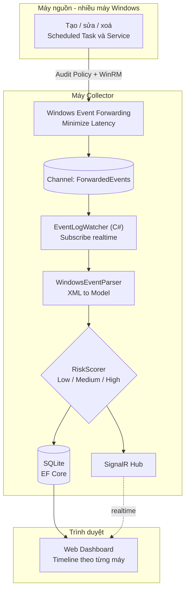

# TaskServiceMonitor

Ứng dụng giám sát tập trung hành vi Scheduled Task và Windows Service qua Windows
Event Log. Dự án thực tập tại Galaxy Innovation Hub (HDBank), mentor thuộc team
Network Security. Đọc file này trước khi thực hiện bất kỳ thay đổi nào.

## Kiến trúc tổng thể



## Trạng thái hiện tại

Đã hoàn thành tuần 1 (kiến thức nền + thực hành xác nhận Event ID).

Tuần 2 — **bước 1 và 2 của roadmap đã xong**:

- Bước 1: `EventWatcherService` subscribe realtime nhiều channel, ghi XML thô ra
  `samples/`. Đã thu **17 mẫu thật**, phủ 8/10 Event ID (thiếu 7034, 7036).
- Bước 2: `WindowsEventParser` chuyển XML → `WindowsMonitorEvent`, có nhánh
  riêng cho 8 Event ID đã có mẫu + nhánh dự phòng cho ID chưa có mẫu.
  Có **24 unit test** chạy trên mẫu XML thật: `dotnet test` — 24/24 pass.

- Bước 3: lưu PostgreSQL qua EF Core + API query lại. Đã verify với DB thật:
  61 event lưu thành công, chạy lại lần hai **không nhân đôi** (unique index
  `IX_Events_Dedup` chặn), `Data` là `jsonb` query được bằng `->>`,
  `dotnet test` 30/30 pass.

- Bước 4: SignalR (`Realtime/MonitorHub.cs`, `Realtime/EventNotifier.cs`) +
  dashboard HTML/JS thuần ở `wwwroot/`. Đã verify: `/` trả `index.html`,
  `/monitorHub/negotiate` trả `connectionId`, `signalr.min.js` phục vụ cục bộ.
- Bước 5: `Monitoring/RiskScorer.cs` + cột `RiskLevel`. Đã verify: backfill
  `--rescore` cập nhật đúng **12 dòng → Medium** (toàn bộ event 4702),
  `?risk=Medium` trả đúng 12 dòng, `dotnet test` **51/51 pass**.

**Toàn bộ roadmap 5 bước đã xong.** Việc còn lại là triển khai WEF nhiều máy
(xem mục cuối file).

## Bước 6 — Quản lý Task/Service bằng WinAPI (theo yêu cầu mới của mentor)

App không chỉ *xem* log nữa mà **tự thao tác** được Task/Service, thao tác đó sinh
ra log thật, rồi chính app bắt lại và hiện lên dashboard. Vòng khép kín.

| Tầng | Cách gọi Windows |
|---|---|
| Service | **P/Invoke `advapi32.dll`** — `OpenSCManager`, `EnumServicesStatusEx`, `QueryServiceConfig`, `CreateService`, `DeleteService`, `ChangeServiceConfig`, `ControlService`. Đúng bộ hàm `services.msc` dùng |
| Scheduled Task | **COM `Schedule.Service`** (late binding, không cần TLB). Windows không expose Task Scheduler qua DLL phẳng |

- `Management/Native/AdvApi32.cs` — chỉ khai báo P/Invoke, không logic. Handle bọc
  `SafeHandle` để không rò khi có exception.
- `Management/ServiceManager.cs`, `Management/TaskManager.cs` — lớp bọc an toàn.
- **`Management/SafeNameGuard.cs` — rào an toàn, đọc kỹ trước khi sửa.** Web UI này
  chạy quyền Administrator (bắt buộc để đọc channel `Security`). Không có rào thì một
  cú bấm nhầm trên trình duyệt xoá mất service hệ thống. Quy tắc: **đọc mọi thứ, ghi
  chỉ trên tên bắt đầu bằng tiền tố** `Management:WritablePrefix` (mặc định
  `WinSentinel`) và phải nằm ở thư mục gốc. Chặn ở **tầng server**, không phải chỉ ẩn
  nút. Có 21 unit test riêng cho lớp này.
- `TaskManager.Create` dựng **đúng XML schema mà `WindowsEventParser` đã biết đọc** —
  XML ghi ra chính là XML đọc lại được từ event 4698.
- Thao tác quản lý **không cần nối gì thêm** để lên dashboard: chúng sinh event
  Windows thật, `EventWatcherService` đang lắng nghe sẵn sẽ bắt được.

### Thao tác nào sinh ra Event ID nào

Bảng này là thước đo độ phủ — app theo dõi 10 ID, tự sinh được 8:

| Event ID | Thao tác trong app |
|---|---|
| 4698 Task created | Tạo task (tên chưa tồn tại) |
| 4699 Task deleted | Xoá task |
| 4700 Task enabled | Nút "Bật" |
| 4701 Task disabled | Nút "Tắt" |
| 4702 Task updated | Ghi đè task đã có (nút "Sửa lệnh") |
| 4697 + 7045 Service installed | Tạo service (một thao tác sinh **hai** event, hai channel khác nhau) |
| 7040 Start type changed | Nút đổi start type |
| 7036 / 7034 | **Không tự sinh được** — máy dev không phát 7036, còn 7034 là service crash, không ép ra được một cách sạch sẽ |

`RegisterTask` dùng cờ `TASK_CREATE_OR_UPDATE`: cùng một endpoint `POST /api/tasks`,
tên chưa có thì sinh 4698, tên đã có thì sinh 4702. Không cần endpoint riêng.

### Feed event ngay trong tab quản lý

`app.js` phát event qua `window.eventBus`, `manage.js` đăng ký nhận. Nhờ vậy tab
Tasks/Services có bảng "event vừa sinh ra" của riêng nó — thao tác xong thấy log ngay,
không phải chuyển sang tab Dashboard. Cùng một luồng SignalR, không mở thêm kết nối.

### Bẫy: SignalR và Minimal API dùng HAI bộ serializer tách biệt

`ConfigureHttpJsonOptions` **chỉ** áp cho Minimal API. SignalR có
`JsonHubProtocolOptions.PayloadSerializerOptions` riêng, đăng ký qua
`AddSignalR().AddJsonProtocol(...)`. Đăng ký thiếu một bên thì enum hiện **số** lúc
realtime rồi thành **chữ** sau khi F5 (đã dính lỗi này một lần).

## Ghi chú kiến trúc bước 4-5

- **Broadcast SignalR nằm ở `EventPersistenceService`, KHÔNG phải
  `EventWatcherService`** như đề bài mentor viết. Lý do: ở kiến trúc này
  `EventWatcherService` không ghi DB, nó chỉ đẩy vào hàng đợi. Broadcast phải
  đặt sau `SaveAsync` trả `true` — nhờ vậy **event trùng không bị đẩy lên UI**.
- **Payload SignalR là `EventSummaryDto`, không kèm `RawXml`** (1-4KB × mỗi
  event × mỗi client). Modal xem raw gọi `GET /api/events/{id}` khi cần.
- `EventSummaryDto.Projection` là **một expression duy nhất** dùng cho cả EF
  (dịch thành SQL) lẫn map trong bộ nhớ (`From()` chạy bản compile) — danh sách
  API và payload SignalR không bao giờ lệch nhau.
- **Bẫy migration khi thêm cột enum-as-string**: EF sinh `defaultValue: ""` cho
  cột string non-null. Chuỗi rỗng **không phải tên enum hợp lệ** → đọc ngược từ
  DB nổ lỗi parse trên mọi dòng cũ. Phải sửa tay thành `defaultValue: "Low"`
  rồi chạy `--rescore`.
- `--rescore` dùng lại chính class `RiskScorer` chứ không viết lại rule bằng SQL
  — một nguồn sự thật duy nhất, backfill không bao giờ lệch với lúc chạy thật.

## Hai chế độ CLI phụ (không cần DB / không cần admin)

| Lệnh | Tác dụng |
|---|---|
| `dotnet run --project TaskServiceMonitor -- --parse-samples` | Chạy parser trên `samples/`, in kết quả — không cần DB |
| `dotnet run --project TaskServiceMonitor -- --rescore` | Chấm lại `RiskLevel` cho toàn bộ event đã lưu |

## Thiết lập môi trường đã có sẵn trên máy dev

- PostgreSQL 17 (bản x64 chạy emulation trên ARM64), service `postgresql-x64-17`,
  database `taskservicemonitor`, user `postgres` / mật khẩu `postgres`.
- `dotnet-ef` 10.0.11 cài global — bản 10 vẫn chạy được với project EF Core 8.
- `psql.exe` ở `C:\Program Files\PostgreSQL\17\bin\`.

> **Bẫy khi gọi `psql` từ PowerShell 5.1**: nháy kép trong câu SQL bị nuốt khi
> truyền sang exe native, nên `SELECT * FROM "Events"` thành `FROM Events` rồi
> báo `relation "events" does not exist` (PostgreSQL hạ hết thành chữ thường nếu
> không có nháy). Cách chắc ăn: ghi SQL ra file `.sql` rồi chạy `psql -f file.sql`.

## Cấu trúc solution

```
TaskServiceMonitor.sln
├── TaskServiceMonitor/          app chính (net8.0-windows)
└── TaskServiceMonitor.Tests/    xUnit, mẫu XML thật nhúng ở Fixtures/
```

Hai cách kiểm tra parser, dùng cả hai tuỳ mục đích:

| Lệnh | Dùng khi |
|---|---|
| `dotnet test` | Lưới an toàn khi sửa parser — tự fail nếu vỡ |
| `dotnet run --project TaskServiceMonitor -- --parse-samples` | Xem nhanh bằng mắt sau khi thu mẫu XML mới |

Fixture test nhúng thẳng vào assembly (`EmbeddedResource`), **không** phụ thuộc
thư mục `samples/` — thư mục đó bị gitignore nên có thể biến mất bất cứ lúc nào.

## Môi trường phát triển — bắt buộc đọc trước khi build/run

- Toàn bộ code PHẢI được viết, build và chạy **bên trong Windows VM** (VMware
  Fusion trên MacBook M4). KHÔNG code trên macOS host rồi build sau — project
  target `net8.0-windows`, dùng API Windows-only (`EventLogWatcher`), macOS
  không có runtime để build hay chạy thử.
- Nếu đang chạy ở môi trường không phải Windows, dừng lại và nhắc người dùng
  chuyển sang VM trước khi build/run, không chỉ viết code suông.

## Tech stack đã chốt

| Lớp | Lựa chọn |
|---|---|
| Backend | ASP.NET Core 8 (Minimal API), 1 project duy nhất, không tách microservice |
| Thu thập log nhiều máy | Windows Event Forwarding — Collector Initiated. **Mentor đã hạ xuống mức tuỳ chọn**: chỉ cần trích log từ máy local là đủ. Đổi sang WEF chỉ là sửa `Channels` thành `["ForwardedEvents"]`, không đụng code |
| Đọc log realtime | `System.Diagnostics.Eventing.Reader.EventLogWatcher`, subscribe channel **local** `ForwardedEvents` trên máy collector — không subscribe remote trực tiếp |
| Lưu trữ | EF Core + **PostgreSQL** (Npgsql 8.0.11). Ban đầu định dùng SQLite, đổi ở bước 3 theo quyết định của user để khỏi phải migrate lại về sau — migration của EF mang tính đặc thù provider, không dùng chung được |
| Nối luồng nhận event → ghi DB | `Channel<T>` bounded (1000) trong bộ nhớ + một `BackgroundService` consumer riêng |
| Đẩy realtime lên UI | SignalR Hub |
| Frontend | HTML/JS thuần trong cùng project ASP.NET Core, không tách Next.js ở giai đoạn MVP |

## Luồng dữ liệu

Nhiều máy Windows (audit policy + WinRM đã bật)
→ Windows Event Forwarding (Minimize Latency)
→ Collector: channel `ForwardedEvents`
→ `EventLogWatcher` subscribe local, nhận `EventRecord`
→ `WindowsEventParser` chuyển XML → model `WindowsMonitorEvent`
→ `RiskScorer` gán `RiskLevel` (Low/Medium/High)

→ `EventQueue` (`Channel<T>`) — handler trả về ngay, không chờ ghi DB
→ `EventPersistenceService` đọc hàng đợi, lưu PostgreSQL qua EF Core (dùng
  `IServiceScopeFactory` vì BackgroundService là singleton còn DbContext là scoped)
→ `IHubContext<MonitorHub>` broadcast qua SignalR
→ Web dashboard nhận realtime, hiển thị timeline theo host + màu theo RiskLevel

## Event ID đang theo dõi

- **Scheduled Task** (channel Security, cần bật Audit Policy "Other Object
  Access Events"): 4698 (created), 4699 (deleted), 4700 (enabled),
  4701 (disabled), 4702 (updated)
- **Service** (channel System, mặc định bật, không cần Audit Policy):
  7045 (installed), 7040 (start type changed), 7036 (state changed)
- Mở rộng tuỳ chọn sau (chưa làm): 4697 (Security, service install),
  7034 (crash), và channel riêng `Microsoft-Windows-TaskScheduler/Operational`
  (106, 140, 141, 200, 201) — phải khai báo riêng trong subscription query vì
  không nằm trong Security/System.

## Quyết định kiến trúc & lý do (để không hỏi lại / đề xuất lại từ đầu)

- **Collector Initiated thay vì Source Initiated**: môi trường lab không có AD
  domain; Source Initiated cần GPO push qua domain, không khả thi ở đây.
- **EventLogWatcher local thay vì tự polling nhiều máy**: WEF đã giải quyết bài
  toán multi-machine ở tầng OS; app chỉ cần đọc một nguồn local duy nhất.
- **C#/.NET thay vì Python**: EventLogWatcher là API .NET native; không có rủi
  ro ARM64 wheel như pywin32 trên Windows ARM64 (VM chạy trên chip M-series);
  tái dùng kinh nghiệm ASP.NET Core/SignalR/EF Core sẵn có từ dự án khác.
- **HTML/JS thuần thay vì Next.js**: tránh overhead CORS + 2 dev server ở giai
  đoạn MVP. Có thể nâng cấp lên Next.js sau nếu cần bản demo polish hơn.

## Field XML đã xác minh (từ mẫu thật, không phải giả định)

Lấy bằng `EventRecord.ToXml()` trên máy dev. Giả định cũ `param1`/`param2` cho
7040 là **SAI** — thực tế 7040 có 4 field, còn 7045 dùng field có tên hẳn hoi:

| Event | Field trong `<EventData>` |
|---|---|
| 7040 | `param1` = tên hiển thị service, `param2` = start type **cũ**, `param3` = start type **mới**, `param4` = tên ngắn service |
| 7045 | `ServiceName`, `ImagePath`, `ServiceType`, `StartType`, `AccountName` |
| 4697 | `SubjectUserSid/Name/DomainName`, `ServiceName`, `ServiceFileName`, `ServiceType`, `ServiceStartType`, `ServiceAccount` |
| 4698/4699/4700/4701 | `SubjectUserSid/Name/DomainName`, `TaskName`, **`TaskContent`** |
| 4702 | giống trên nhưng field là **`TaskContentNew`** |

Các bẫy đã dính khi viết parser (17 mẫu thật trong `TaskServiceMonitor/samples/`):

- **`4702` dùng `TaskContentNew`, không phải `TaskContent`** như 4698-4701. Đọc
  chung một tên cho cả nhóm task sẽ âm thầm mất dữ liệu đúng ở event "task bị
  sửa" — event nhạy cảm nhất về bảo mật.
- **`4697` và `7045` mô tả cùng hành động (cài service) nhưng khác cả tên field
  lẫn định dạng giá trị**: 4697 trả mã số (`ServiceStartType='3'`,
  `ServiceType='0x10'`), 7045 trả chữ (`'demand start'`, `'user mode service'`).
  Parser phải chuẩn hoá về một dạng thì dashboard mới gộp được.
- **`TaskContent` là XML lồng trong XML** (bị escape trong thẻ `Data`). Phải
  parse tầng hai mới lấy được command / run level.
- **Task không nhất thiết chạy bằng `<Exec>`** — nhiều task hệ thống dùng
  `<ComHandler>` với một CLSID và **không hề có `<Command>`**. Không được coi
  đây là parse lỗi; phải lưu lại `ActionType` + CLSID.
- **Nhóm Security (4697-4702) có `<Security/>` RỖNG** ở phần `<System>`, phải
  lấy user từ `SubjectUserName` trong `EventData`. Ngược lại 7040/7045 lại có
  `<Security UserID='...'/>` mà không có `SubjectUserName`.
- **Không giả định mọi Event ID đều dùng `param*`** — 7045 không có field nào
  tên `param*`. Luôn đọc theo `Data Name=`.

## Hướng mentor giao tiếp theo (CHƯA làm, cố ý hoãn)

- **Phân tích tương quan hành vi**: ví dụ phát hiện "task vừa tạo đã bị xoá ngay",
  tức là nhìn *chuỗi* event chứ không chỉ từng event rời rạc. `RiskScorer` hiện chấm
  điểm từng event độc lập — muốn làm tương quan thì cần một tầng riêng đọc lại nhiều
  event gần nhau theo `ObjectName` + cửa sổ thời gian.
- **Signature virus** — mentor sẽ giao nghiên cứu sau.
- Không đoán trước cấu trúc cho hai phần này; chờ mentor chốt phạm vi.

## Gaps / cần xác minh trước khi code phần liên quan

- **7036 và 7034 không có mẫu, parser CỐ Ý chưa xử lý** — đã kiểm tra kỹ: máy
  dev (Windows 11 ARM64) không hề phát 7036. SCM ở đây chỉ ghi
  7023/7026/7030/7031/7040/7043/7045 — start/stop service **không** sinh 7036.
  Hai ID này rơi vào nhánh dự phòng của parser (vẫn ra event hợp lệ, chỉ thiếu
  field chi tiết). **Không đoán cấu trúc** — chờ có mẫu thật rồi mới viết nhánh
  riêng. Xem `WindowsEventParser.RecognizedEventIds` để biết ID nào đã xử lý.
- **Cân nhắc bổ sung 7031** (service terminated unexpectedly) — máy dev CÓ event
  này, trong khi 7034 thì không. Nếu mục tiêu là bắt service crash thì 7031 khả
  dụng hơn 7034. Chưa thêm vì nằm ngoài danh sách mentor giao.
- **4697 cần Audit Policy KHÁC 4698-4702**: 4698-4702 dùng subcategory
  `"Other Object Access Events"`, còn 4697 dùng `"Security System Extension"`.
  Bật thiếu một trong hai thì nhóm tương ứng sẽ không bao giờ xuất hiện.
- EventLogWatcher ở bước scaffold ban đầu chưa lưu bookmark — nếu app restart
  sẽ bỏ lỡ event forward tới trong lúc app down (dù event vẫn còn trong
  `ForwardedEvents` trên collector). Cần thêm `EventBookmark` persistence sau
  khi MVP chạy ổn định.
- **Không đặt giá trị mặc định cho property kiểu mảng trong Options class** —
  `ConfigurationBinder` của .NET **nối thêm** vào mảng sẵn có chứ không ghi đè.
  Để `Channels { get; init; } = ["System"]` rồi config `["System","Security"]`
  sẽ ra `["System","System","Security"]` (đã dính lỗi này một lần). Mặc định để
  mảng rỗng, áp giá trị mặc định ở property tính toán (`EffectiveChannels`).
- **Lỗi thiếu quyền đọc `Security` KHÔNG throw lúc `watcher.Enabled = true`** —
  subscribe vẫn báo thành công, nhưng đến lúc đọc event thì nổi lên bất đồng bộ
  qua `EventRecordWrittenEventArgs.EventException` với message
  `"The handle is invalid."`. Luôn phải xử lý `e.EventException` trong handler,
  không chỉ bọc try/catch quanh chỗ subscribe.

## Quy ước code

- Model dùng C# `record` (immutable), không dùng class thường cho DTO.
- Tên field của `WindowsMonitorEvent` bám theo spec mentor giao (`Id`, `Hostname`,
  `ActorAccount`, `ObjectType`, `ObjectName`, `ActionDescription`, `RawXml`),
  **không tự đổi tên** cho "hợp lý hơn" — mentor đối chiếu theo spec đó. Field
  bổ sung (`ImagePath`, `StartType`, `TaskActionType`...) đặt sau, tách nhóm rõ.
- `TimeCreated` luôn lưu **UTC** (`DateTimeKind.Utc`), chỉ đổi sang giờ máy lúc
  hiển thị — nhiều máy nguồn có thể khác múi giờ.
- Danh sách Event ID theo dõi khai báo tập trung một chỗ —
  `Monitoring/MonitoredEventIds.cs` (`TaskEventIds` / `ServiceEventIds` / `All` +
  `BuildXPathFilter()`), không hardcode rải rác nhiều nơi trong code.
  `WindowsEventParser` ở bước 2 phải **tham chiếu** class này, không khai lại.
- BackgroundService không được inject trực tiếp `DbContext` (scoped) — luôn
  dùng `IServiceScopeFactory` để tạo scope mới mỗi lần cần truy cập DB.
- **Không gọi việc gì tốn thời gian bên trong `EventRecordWritten`** — đó là
  callback **đồng bộ** do Windows gọi; chặn nó sẽ làm nghẽn luồng nhận event.
  Handler chỉ parse rồi `EventQueue.TryEnqueue`, còn `EventPersistenceService`
  mới là chỗ ghi DB. Hàng đợi có chặn trên và **log Warning kèm số đếm khi rớt
  event** — mất dữ liệu giám sát thì phải kêu to, không được im lặng.

## Roadmap triển khai (chạy tuần tự, không nhảy bước)

1. ~~Scaffold project + `EventLogWatcher` subscribe thô, log raw XML ra console
   để lấy mẫu thật (chưa parse)~~ ✅ **xong** — xem `TaskServiceMonitor/Monitoring/`
2. ~~Viết `WindowsEventParser` dựa trên XML mẫu thật đã lấy được ở bước 1~~
   ✅ **xong** — `Monitoring/WindowsEventParser.cs` + model
   `Models/WindowsMonitorEvent.cs`. Kiểm tra lại bất cứ lúc nào bằng
   `dotnet run --project TaskServiceMonitor -- --parse-samples`
3. ~~Thêm EF Core + persistence~~ ✅ **xong, đã verify với DB thật** —
   `Data/MonitorDbContext.cs`, `Data/EventStorageService.cs`,
   `Monitoring/EventQueue.cs`, `Monitoring/EventPersistenceService.cs`,
   `Api/EventEndpoints.cs`. Dùng **PostgreSQL** chứ không phải SQLite.
4. ~~Thêm SignalR Hub + dashboard cơ bản~~ ✅ **xong** — `Realtime/`, `wwwroot/`
5. ~~Thêm `RiskScorer` + nâng cấp dashboard~~ ✅ **xong** —
   `Monitoring/RiskScorer.cs`, summary card, filter risk, modal xem raw XML

Mỗi bước có điểm dừng để xác nhận kết quả đúng trước khi sang bước tiếp theo —
không chạy hết một lượt.